| Lab |  1  |
| --  | -- |

| Módulo | Título | 
| --  | -- |
| Escaneos de seguridad en una pipeline | Creación de una pipeline para escaneo mediante WhiteSource |

### Lab overview
Azure te permite ejecutar y desplegar todo tipo de scripts y código en producción, lo que implica la aparición de muchos problemas de seguridad que hay que atajar de alguna manera, sobre todo para evitar que alguien, de forma intencionada, ejecute código malicioso. 

Una de las maneras de atacar de raíz estos problemas, consiste en la utilización de ciertas tasks dentro de las propias pipelines, que nos alerten de cualquier tipo de brecha de seguridad en nuestro código.

### Objetivos
- Crear una cuenta de Azure DevOps e introducir nuestro propio código dentro.
- Crear una build pipeline basada en productos **open source**.
- Instalar _WhiteSource Bolt_ desde el marketplace de Azure DevOps y activarlo.
- Añadir _WhiteSource Bolt_ como una tarea dentro de una pipeline.
- Ejecutar nuestra build pipeline y poder analizar el informe generado por _WhiteSource Bolt_ en relación a defectos o vulnerabilidades de seguridad.

### Duración
80 minutos aproximádamente.

### Prerrequisitos
- Subscripción de Azure.
- Cuenta de Azure Devops.

### Instrucciones
## Tarea 1: Crear y configurar un entorno de Azure Devops.
Nuestra primera tarea será la de crear un proyecto de Azure DevOps, para lo cual, vamos a necesitar una cuenta de Azure DevOps y una cuenta de Microsoft.

1 - Nos logueamos dentro de la web de Microsoft de este enlace [enlace](https://azure.microsoft.com/en-us/services/devops/).

2 - Dentro de la misma web, si no tenemos una cuenta de Azure DevOps todavía, la solución pasa por seleccionar la opción de comenzar de forma gratuita o "Start free" si lo tenemos en inglés. De lo contrario, seleccionamos la opción de _Sign in to Azure DevOps_.

3 - A continuación, accedemos a la dirección [https://dev.azure.com/](https://dev.azure.com/) y se nos abrirá una ventana como la que vemos a continuación, donde se muestra a la izquierda los proyectos ya creados dentro de la organización (debería estar vacío).

4 - Hacemos click sobre el botón _"+ Create Project"_

5 - En la nueva ventana le damos los siguientes valores y pinchamos en el botón _Create_:
  - Project name: **securityandcomplianceproyecto**
  - Description: lo podéis dejar en blanco o poner lo que queráis, no es necesario.
  - Visibility: Private
  
      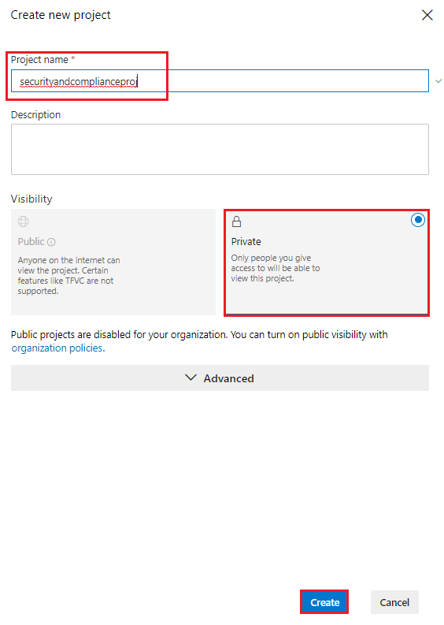
  
6 - Automáticamente seréis redirigidos al proyecto que acabáis de crear, y veréis los distintos menues en la parte izquierda de la pantalla. Vais a _Repos_ y como estará vacío, os ofrecerá varias opciones. Vosotros vais a ir a la sección _"or import a repository"_ y pincháis en **Import**. 

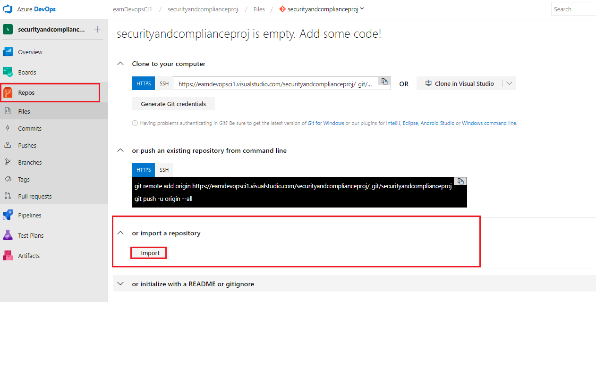

7 - En esta nueva ventana de _Import a Git Repository_ vais a meter los siguientes valores y le daréis a **Import**. Tal y como se aprecia en la imagen.
  - Source type:Git
  - Clone URL: https://github.com/Microsoft/PartsUnlimitedMRP.git

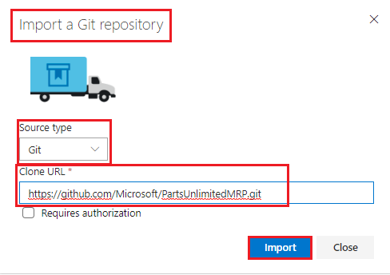

8 - Una vez importado, deberáis ser capaces de ver todo el contenido del repositorio que acabamos de importar, desde el submenú _Repos\Files_ en la parte izquierda.

## Tarea 2: Crear la pipeline

1 - Ve al menú lateral _Pipelines > Builds_ y pincha el botón **New Pipeline**.

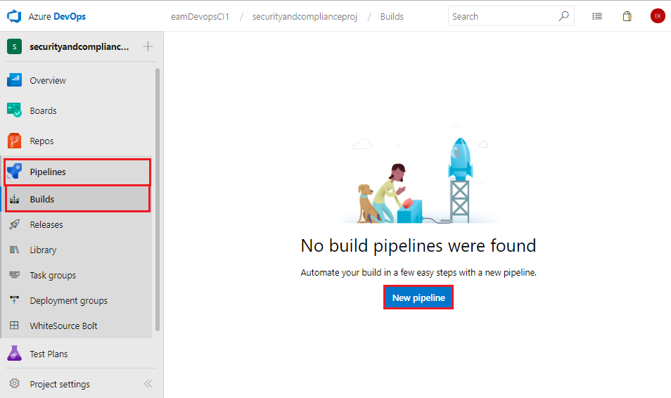

2 - En la siguiente ventana, vamos a ingresar los siguientes valores y pincharemos en **Continue**:
  - Select a source: Azure Repos Git (debería ser el valor por defecto)
  - Team project: el que hemos creado anteriormente.
  - Repository: el que hemos importado anteriormente.
  - Default branch for manual and scheduled builds: **master**

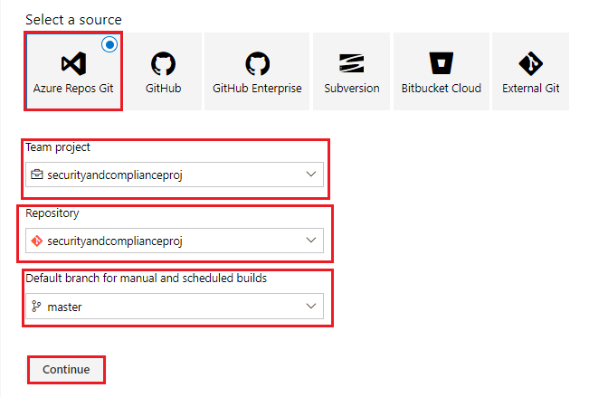
 
3 - En la parte de **Select a template** baja hasta el final de la lista donde se encuentra la opción **Empty pipeline** y pincha en **Apply**.

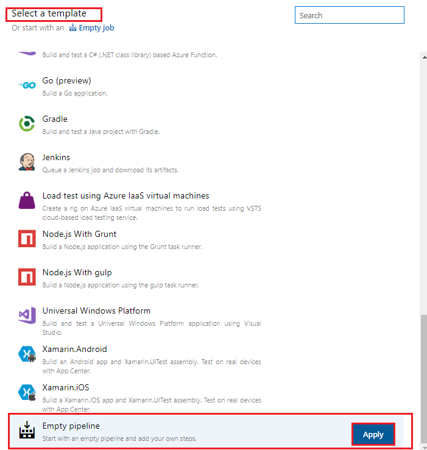

4 - Dentro de la pestaña **Task**, pincha en _Pipeline_, y en la parte derecha verás que te indica la necesidad de tener seleccionado un _Agent pool_ (o lo que es lo mismo, un grupo de máquinas donde ejecutar el código). Selecciona **Hosted VS2017**

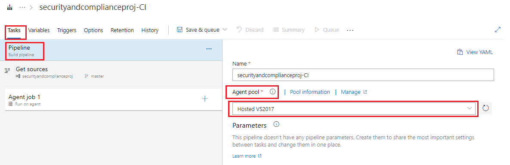

5 - Selecciona **Agent job 1**, pincha en el _+_ de su derecha para añadir una task nueva. A la derecha, selecciona la pestaña _Build_ y baja hasta encontrar en la lista la task de _Gradle_. Pincha en **Add** tres veces, para que aparezcan todas en la parte izquierda como nuevas tasks de la pipeline. Utilizaremos Gradle para compilar el _Integration Service_, el _Order Service_ y los componentes de los clientes de la aplicación MRP.

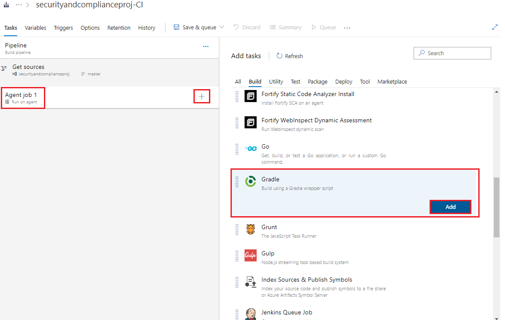

6 - Selecciona la primera task de Gradle para introducir los siguientes valores, dejándo los valores por defecto en los campos no mencionados.
  - Display name: IntegrationService
  - gradle wrapper: src/Backend/IntegrationService/gradlew (puedes escribirlo o buscarlo en el botón "...")
  - Working Directory: src/Backend/IntegrationService (puedes escribirlo o buscarlo en el botón "...")
  - JUnit Test Results: deselecciona el checkbox de **Publish to Azure Pipelines/TFS**, dado que no ejecutaremos test automáticos en el _Integration Service_.
  
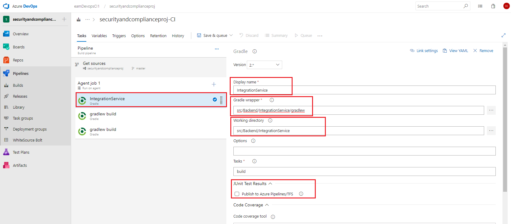

7 - Selecciona la segunda task de Gradle para introducir los siguiente valores, dejando los valores por defecto en los campos no mencionados.
  - Display name: OrderService
  - gradle wrapper: src/Backend/OrderService/gradlew (puedes escribirlo o buscarlo en el botón "...")
  - Working Directory: src/Backend/OrderService (puedes escribirlo o buscarlo en el botón "...")
  - JUnit Test Results: selecciona el checkbox de **Publish to Azure Pipelines/TFS**, y pon el valor del campo _Test Results Files_ a \*\*/TEST-\*.xml". Dado que el _Order Service_ tiene tests unitarios en el proyecto, podemos automatizar su ejecución como parte de la compilación.
  
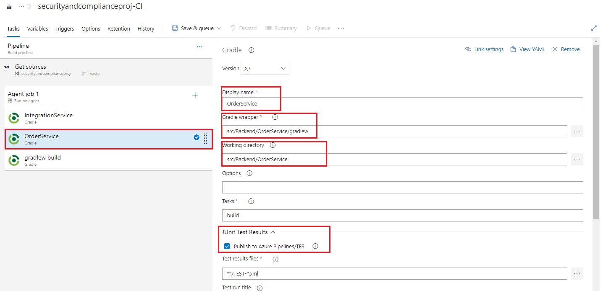

8 - Selecciona la tercera task de Gradle para introducir los siguiente valores, dejando los valores por defecto en los campos no mencionados.
  - Display name: Clients
  - gradle wrapper: src/Clients/gradlew (puedes escribirlo o buscarlo en el botón "...")
  - Working Directory: src/Clients (puedes escribirlo o buscarlo en el botón "...")
  - JUnit Test Results: deselecciona el checkbox de **JUnit Test Results** que publica en TFS/Team Services dado que no ejecutaremos ningún test en esta tarea.

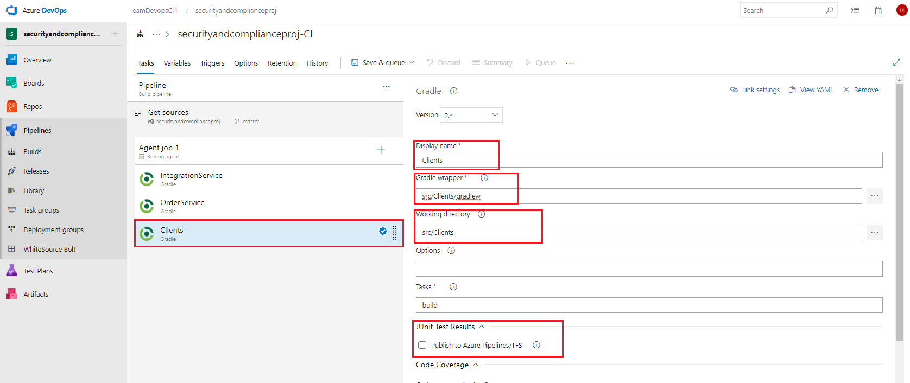

9 - Selecciona **Agent job 1**, pincha en el _+_ de su derecha para añadir una task nueva. Ahora en la parte derecha nos vamos a la pestaña _Utility_ y bajamos hasta encontrar la task **Copy files** (también podemos usar el cuadro de búsqueda si nos resulta más rápido). La damos al botón de añadir dos veces para que nos meta dos tasks en la parte izquierda.

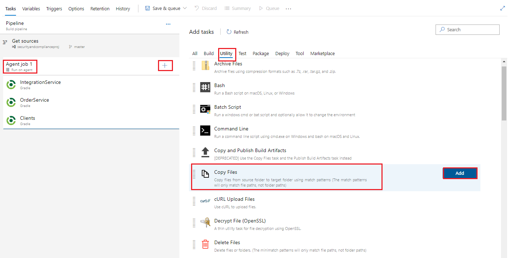

10 - Seguimos en la parte derecha añadiendo tareas nuevas. Ahora, bajo la misma pestaña de _Utility_, buscamos la task **Publish Build Artifacts**. Añadimos dos veces también.

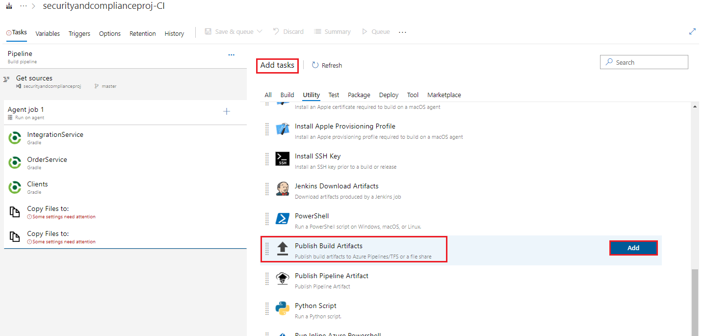

11 - Selecciona la primera de las tareas de copiado y rellena los valores de la misma con los siguientes datos, dejando por defecto el resto de valores no indicados.
  - Source Folder: **$(Build.SourcesDirectory)\src** (puedes escribirlo o buscarlo en el botón "...")
  - Contents: */build/libs/!(buildSrc).?ar
  - Target Folder: **$(build.artifactstagingdirectory)\drop**

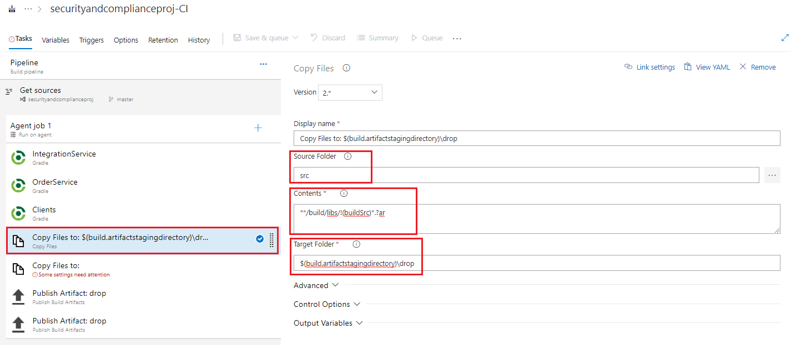

**NOTA:** vamos a copiar los archivos que queramos de la compilación y del repositorio, y dejarlos en un área intermedia en el agente (staging), para publicarlas como artefactos de la propia pipeline, y que podremos reusar en la parte de release. Si quieres saber más acerca de las variables que vamos a usar en la pipeline, puedes acceder a este [enlace](https://docs.microsoft.com/en-us/azure/devops/pipelines/build/variables?view=azure-devops&viewFallbackFrom=vsts&tabs=yaml)

12 - Selecciona la segunda task de copia y rellena los valores de la misma con los siguientes datos, dejando por defecto el resto de valores no indicados.
  - Source Folder: $(Build.SourcesDirectory)
  - Contents: \*\*/deploy/SSH-MRP-Artifacts.ps1 \*\*/deploy/deploy_mrp_app.sh \*\*/deploy/MongoRecords.js
  - Target Folder: $(build.artifactstagingdirectory)

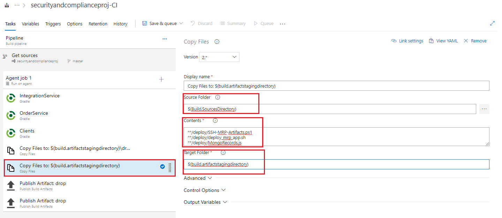

**NOTA:** intenta mantener el formato como en la imagen para asegurarnos de que la tarea funciona de forma correcta. Finalmente, cuando compruebes los artefactos de la build al final del lab, te darás cuenta de si la tarea está funcionando correctamente o no.
  
13 - Selecciona la primera tarea de **Publish Artifacts** y rellena los valores de la misma con los siguientes datos, dejando por defecto el resto de valores no indicados.
  - Path to publish: $(build.artifactstagingdirectory)\drop
  - Artifact Name: drop
  - Artifact publish location: Azure Pipelines/TFS

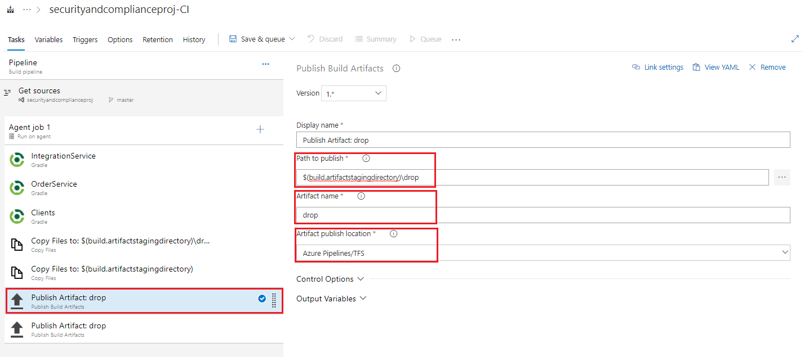

**NOTA:** en estas tareas de publicación, vamos a coger los elementos del área intermedia del agente (staging) y los publicaremos como artefactos para luego usarlos en la release. No vamos a crear, ni desplegar utilizando la release de este lab, pero si quieres, puedes retener esta build para más adelante jugar con ella.

14 - Selecciona la segunda tarea de **Publish Artifacts** y rellena los valores de la misma con los siguientes datos, dejando por defecto el resto de valores no indicados.
  - Path to publish: $(build.artifactstagingdirectory)\deploy
  - Artifact Name: deploy
  - Artifact publish location: Azure Pipelines/TFS

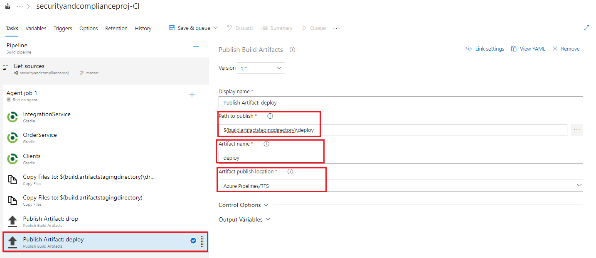

15 - Pincha en **Save and Queue**, y después el mismo valor de la lista desplegable, para poder guardar la pipeline y ejecutar de forma manual la build. En el cuadro de diálogo siguiente, vuelve a seleccionar lo mismo.

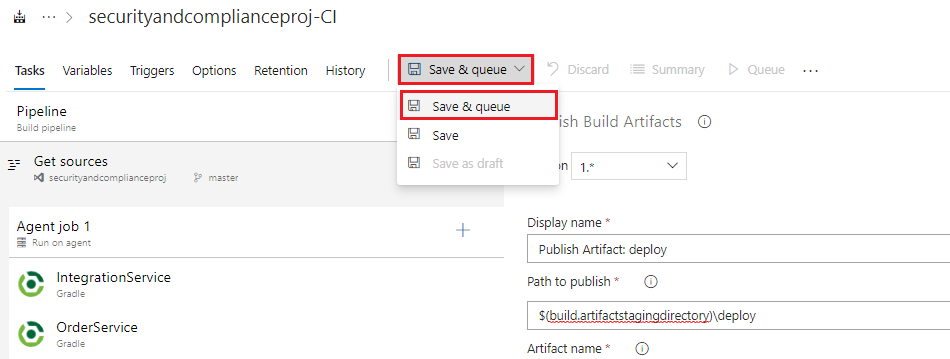

16 - En el baner resultante que aparecerá encima de la definición de la pipeline, pincha en el link con un número para ver los logs que va sacando la ejecución.

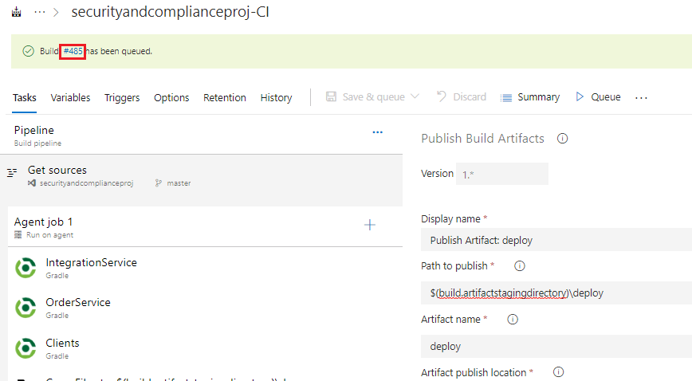

17 - Mira la información de salida y cómo progresa por los diferentes steps, asegurándote de que todos terminan de forma satisfactoria.

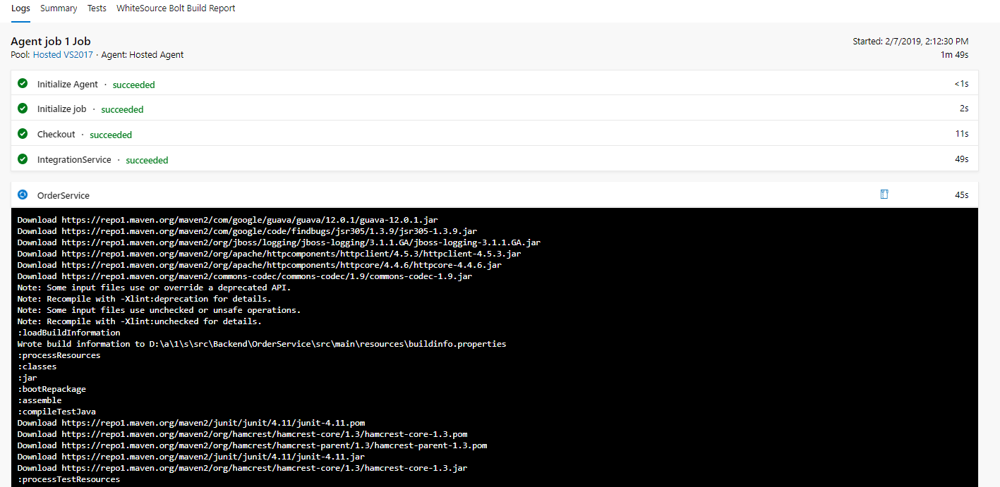

## Tarea 3: Instalar WhiteSource Bolt desde Azure DevOps Marketplace y activarlo.

1 - Volvemos a la pipeline que acabamos de ejecutar y bajo la pestaña de Tasks, pinchamos en **Agent job 1**. Dentro le damos al _+_ para añadir una nueva task. En este caso, vamos a pinchar en **Marketplace** y buscamos por "_whitesource_", localizamos **WhiteSource Bolt** y pinchamos al botón **Get it free**

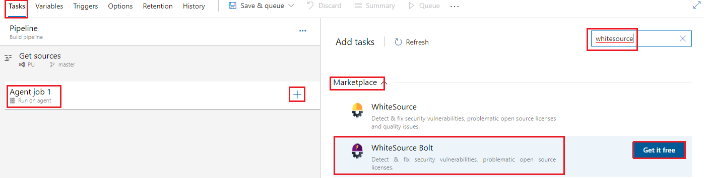

2 - Serás redireccionado a la página de **WhiteSource Bolt** dentro de **Azure DevOps Marketplace**, pinchamos en **Get it free** otra vez.

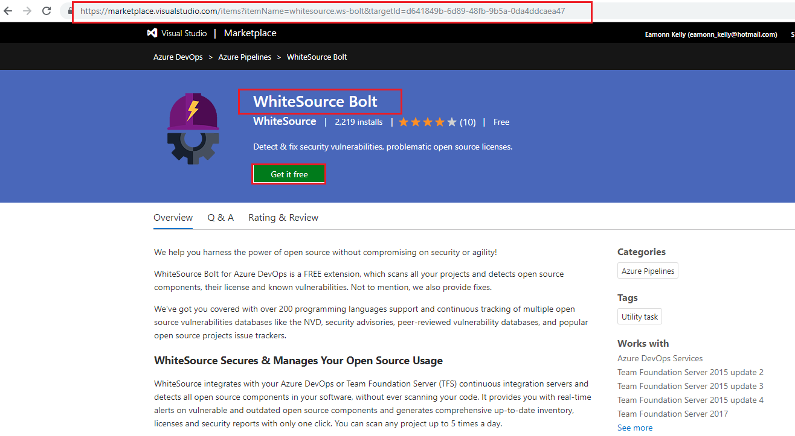

3 - Nos pedirá el nombre de la organización, y escribiremos la nuestra. Después pinchamos en _Install_.

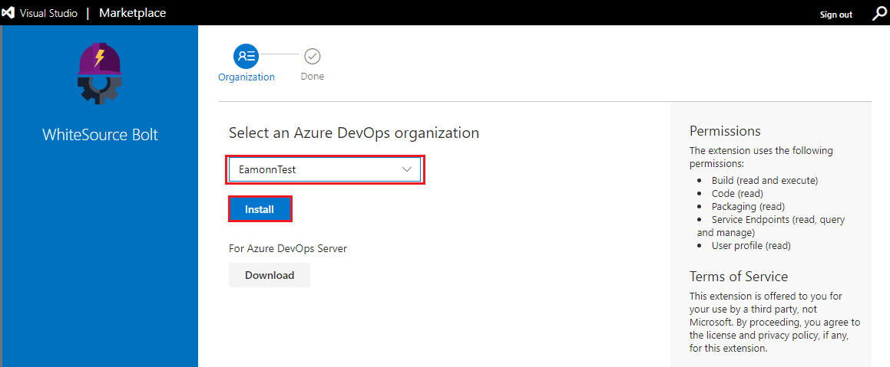

4 - Una vez instalado, pinchamos en el botón de **Proceed to organization** para regresar.

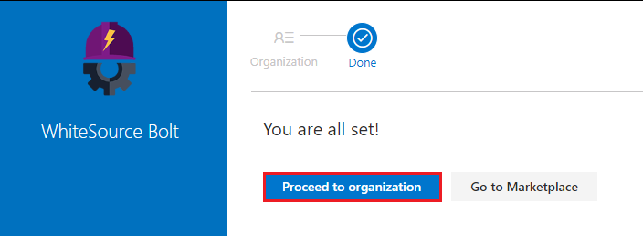

5 - Ahora dentro de nuestro proyecto de Azure DevOps, tendremos una nueva opción dentro del menú de **Pipelines** para **WhiteSource Bolt**, pinchamos en ella.

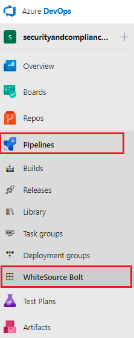

6 - Si te lo pide, introduce tu dirección de email y organización para activar la extensión de WhiteSource Bolt. Puede que no sea necesario introducir tu email dependiendo de tu entorno, y en este caso serás redirigido directamente a la web de _Your are using a FREE version of WhiteSource Bolt_, indicando que está lista para ser integrada en tus pipelines.

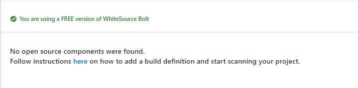

## Tarea 4: Añadir WhiteSource Bolt como una _build task_ dentro de nuestra pipeline.

1 - Regresa a la build pipeline creada en los pasos anteriores, y bajo la tab **Tasks**, vete a la sección **Agent job 1**, pincha en el _+_ para añadir una nueva tarea. En la pestaña de _Utility_, baja hasta encontrar la task **WhiteSource Bolt** y añadela.

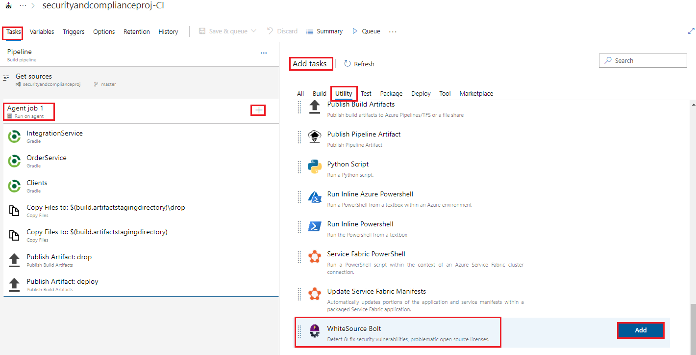

2 - Mueve la task que acabas de añadir para colocarla justo después de la tarea de **Gradle** llamada _Clients_, o lo que es lo mismo, la última tarea de Gradle.

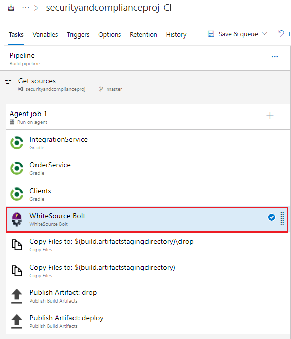

3 - Acepta los valores por defecto de la tarea de **WhiteSource Bolt** y guarda los cambios de la pipeline.

## Tarea 5: Ejecutar nuestra build pipeline y ver el informe de seguridad resultante de WhiteSource Bolt.

1 - Inicia una nueva ejecución de la pipeline pinchando en **Queue** y en la nueva ventana pincha **Queue** otra vez.

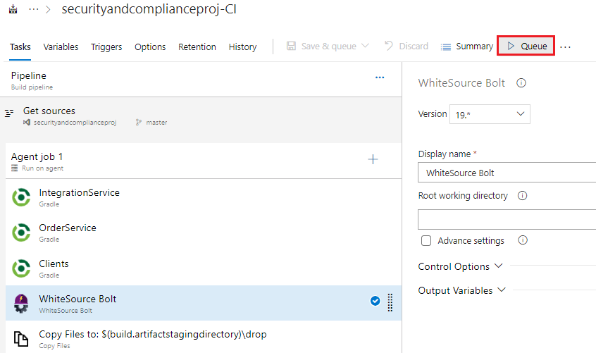

2 - En el baner resultante, pincha en el link con el número para ver el resultado de la ejecución.

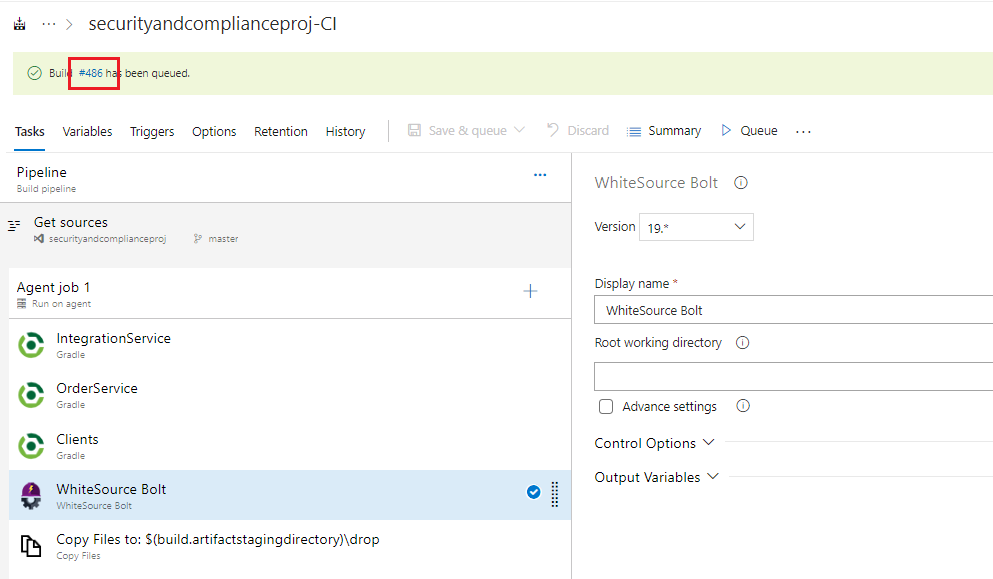

3 - Observa el progreso de la ejecución y asegúrate que todos los pasos se completan correctamente.

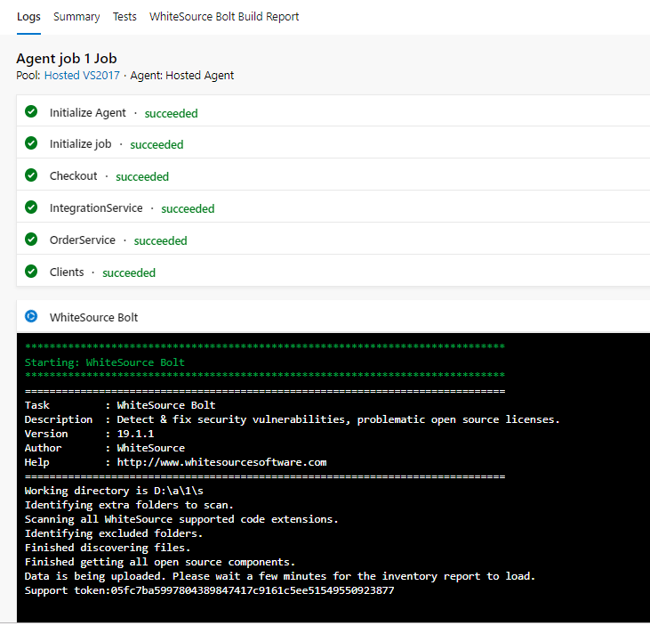

4 - Cuando se complete la build pipeline, pincha en **Pipelines > WhiteSource Bolt** y observa los resultados obtenidos.

5 - Avanza por el informe para encontrar estos elementos:
  - Vulnerability Score
  - Vulnerable Libraries
  - Severity Distribution
  - Aging Vulnerable Libraries
  - License Risks and Compliance and the associated Risk level: Apache 2.0 is listed with Risk level unknown, and two occurrences of it
  - Outdated libraries section > there is one item list gradle-REL_1.0-milestone-1, view the version details and what the recommendations are i.e. Consider updating to latest version.
  - Inventory

**NOTE**: ten en cuenta que hay una opción para exportar el informe.

Enhorabuena!! acabas de crear una build pipeline de código abierto, y le has añadido _WhiteSource Bolt_ a la misma, pudiendo analizar todas las vulnerabilidades en cuestión de seguridad del código.
