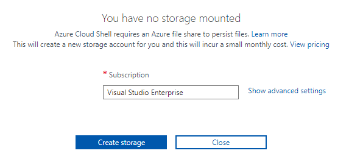

| Lab |  1  |
| --  | -- |

| Módulo | Título | 
| --  | -- |
| Manejo de secretos, tokens y certificados | Uso de Azure KeyVault para el almacenamiento de secretos |

## Lab overview

## Objetivos
El objetivo de esta práctica es entender la responsabilidad que delegamos en Azure keyVault para almacenar datos sensibles, que nadie será capaz de ver o usar, a menos que nosotros lo diseñemos de esa manera.

## Duración
90 min aprox.

## Instrucciones

### Antes de comenzar
Para poder empezar con la práctica, vamos a necesitar:
- Azure KeyVault creado en un Azure ResourceGroup (RG).
- Base de datos CosmosDB creada en el mismo Azure RG.
- Un Azure App Service creado en el mismo Azure RG.
- Cliente Rest para su uso desde vuestro pc personal. Puede ser un cliente online, como por ejemplo [Advanced REST Client](https://chrome.google.com/webstore/detail/advanced-rest-client/hgmloofddffdnphfgcellkdfbfbjeloo/related) de Google Chrome.
- Visual Code instalado en vuestro pc.

Para la preparación de este lab, os vamos a proveer de todo lo necesario para que podáis levantar la infraestructura en Azure de forma automática, mediante la ejecución de ARM templates. Esto nos permitirá tener funcionando el Azure KeyVault, CosmosDB y el App Service.

Estos templates los podréis localizar en la carpeta de recursos del módulo 4, en la ruta "AzureLabs/Recursos/4 - Manejo de secretos, tokens y certificados/Lab1_AzureKeyVault_localhost/ARM_templates"

La estructura que vamos a crear, responde al siguiente diseño. Puede parecer muy complejo, pero es lo más sencillo que nos vamos a encontrar en el manejo de secretos dentro de Azure.


### Tarea 1 : Vamos a cargar los ARM templates en vuestra cuenta de Azure.
1 - Hacemos log in en nuestra cuenta personal de Azure (o en la cuenta de una persona del grupo, en caso de serlo).
2 - Nos dirigimos al [portal de Azure](https://portal.azure.com/#home).
3 - Creamos un ResourceGroup nuevo, dentro del cuál se irán creando todos los demás componentes. Esto facilitará al final de la práctica, la eliminación de todos los recursos de forma conjunta.
  - Desde el shell del portal de Azure, ejecutamos el siguiente comando.    
```sh
az deployment group create --name AzureLabsModulo4Lab1Deployment --resource-group AzureLabsModulo4Lab1 --template-uri "https://github.com/MscDevOpsSecurity/AzureLabs/blob/6239ab3be061c40e86c2da269feb69455c1cdeac/Recursos/4%20-%20Manejo%20de%20secretos,%20tokens%20y%20certificados/ARM%20templates/placeholder.md" --parameters storageAccountType=Standard_GRS
```
  **Tip:** Si no tenemos el recurso creado para el shell de Azure, nos aparecerá una ventana como la siguiente, que nos pedirá que elijamos la subscripción de Azure donde poder montar el storage account para el shell. Si solo tenemos una subscripción, estará seleccionada por defecto, solo nos queda pinchar en _Create storage_.
  
  
  
  - Tardará un rato en completarse la tarea, pero lo que nos queda claro, es que cuando termine, este template que acabamos de ejecutar nos creará automáticamente los 3 recursos que necesitamos: Azure KeyVault, CosmosDb y el App Service (Web App) sin más intervención.
4 - Accedemos al Resource group que acabamos de crear, para asegurarnos de que todos los recursos previamente mencionados están ahí.

### Tarea 2: Vamos a preparar el código para ejecutar en nuestro visual studio code.

1 - Al clonar este repositorio, nos hemos descargado el código fuente necesario en la ruta "AzureLabs/Recursos/4 - Manejo de secretos, tokens y certificados/source/initial/". Solo tenemos que abrir la solución con VS Code/Visual Studio 2019 Community o el editor gráfico que queráis. 

2 - Compilamos el código para asegurarnos de que todo está correctamente preparado.

3 - Ahora vamos a fijarnos en el archivo _appsettings.json_, porque en él reside el principal problema que vamos a resolver con esta práctica. En él podéis ver, en la sección llamada **"CosmosDB"**, como la key (o contraseña) de la base de datos está en texto plano. Es cierto que está codificada en base64 y no es fácilmente legible, pero si alguien se hiciese con ella, solo tendría que copiarla y pegarla donde la necesite, para poder acceder a todos los recursos de nuestra base de datos en la nube.


4 - Vamos a ejecutar nuestra aplicación, la cual será un servicio web que se quedará esperando por peticiones REST (GET, PUT, POST, DELETE..).

5 - Una vez esté la aplicación corriendo, nos dirigimos al cliente Rest que tengamos en nuestro laptop y vamos a ejecutar la siguiente request:
  - Lo primero que vamos a hacer, para facilitar la ejecución del lab, es quitar la autenticación que nos exije nuestro cliente REST (no es buena práctica hacer esto, y por ello vamos a volver a restaurarlo al finalizar la misma). Seguro que el cliente tiene algún tipo de configuración o settings, que os permiten deshabilitar la validación SSL, hacedlo.


  - Operación: **GET**
  - Barra de direcciones: _http://localhost:puerto/api/Items_, donde \<puerto\> será un valor numérico especificado en vuestro archivo _launchSettings.json_ dentro del código.
  - Pinchamos en "Send/Enviar"


  - La respuesta tiene que ser casi inmediata, ya que estamos trabajando en localhost. En la sección **Response** del cliente REST, debéis tener algo como lo que se muestra a continuación, que no es otra cosa que el contenido extraído de la base de datos CosmosDB en Azure. Podéis probar a introducir nuevos valores desde el propio portal, volver a ejecutar este comando y ver los resultados, para aseguraros que realmente se extraen de ahí y no hay truco.

6 - Como hemos visto, la aplicación funciona, pero con la contraseña de la base de datos totalmente expuesta al público que use la aplicación web. Para solucionar este problema, nace nuestro primer resource dentro de Azure, **Azure KeyVault**.

### Tarea 3: Conectar nuestra aplicación web con Azure KeyVault mediante código.

### Tarea 4: Crear un App Registration en Azure Active Directory (AD)

### Tarea 5: Crear certificados de seguridad e instalarlos donde se requieran

### Tarea 6: Comprobemos de nuevo la aplicación
