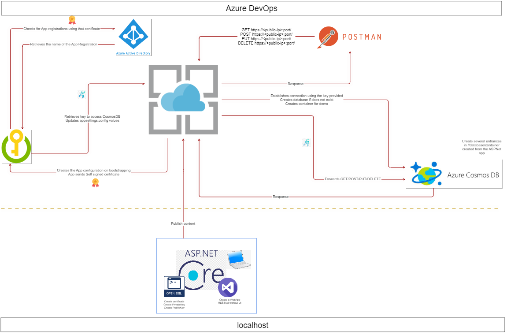
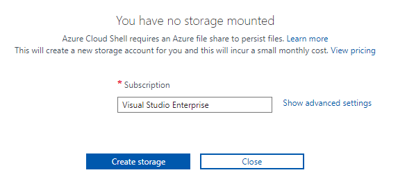
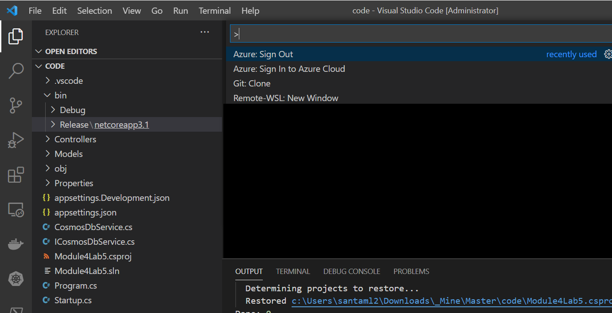
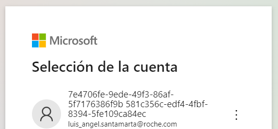
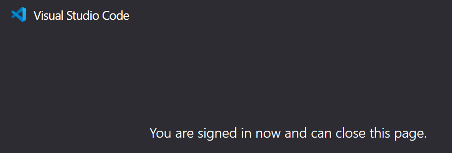
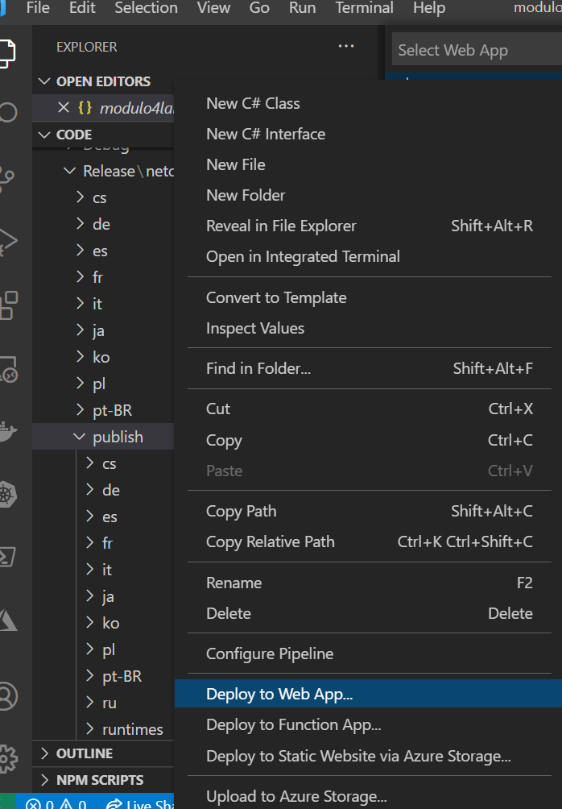
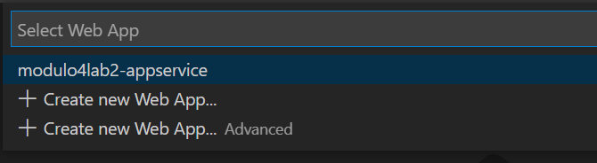
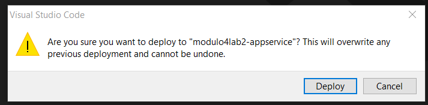
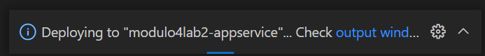
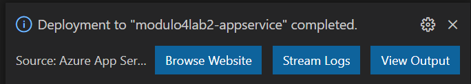

| Lab |  1  |
| --  | -- |

| Módulo | Título | 
| --  | -- |
| Manejo de secretos, tokens y certificados | Uso de Azure KeyVault para el almacenamiento de secretos |

## Lab overview

## Objetivos
El objetivo de esta práctica es entender la responsabilidad que delegamos en Azure keyVault para almacenar datos sensibles, que nadie será capaz de ver o usar, a menos que nosotros lo diseñemos de esa manera.

## Duración
90 min aprox.

## Instrucciones

### Antes de comenzar
Para poder empezar con la práctica, vamos a necesitar:
- Azure KeyVault creado en un Azure ResourceGroup (RG).
- Base de datos CosmosDB creada en el mismo Azure RG.
- Un Azure App Service creado en el mismo Azure RG.
- Cliente Rest para su uso desde vuestro pc personal. Puede ser un cliente online, como por ejemplo [Advanced REST Client](https://chrome.google.com/webstore/detail/advanced-rest-client/hgmloofddffdnphfgcellkdfbfbjeloo/related) de Google Chrome.
- Visual Code instalado en vuestro pc.

Para la preparación de este lab, os vamos a proveer de todo lo necesario para que podáis levantar la infraestructura en Azure de forma automática, mediante la ejecución de ARM templates. Esto nos permitirá tener funcionando el Azure KeyVault, CosmosDB y el App Service.

Estos templates los podréis localizar en la carpeta de recursos del módulo 4, en la ruta "AzureLabs/Recursos/4 - Manejo de secretos, tokens y certificados/Lab1_AzureKeyVault_localhost/ARM_templates"

La estructura que vamos a crear, responde al siguiente diseño. Puede parecer muy complejo, pero es lo más sencillo que nos vamos a encontrar en el manejo de secretos dentro de Azure.



### Tarea 1 : Vamos a cargar los ARM templates en vuestra cuenta de Azure.
1 - Hacemos log in en nuestra cuenta personal de Azure (o en la cuenta de una persona del grupo, en caso de serlo).
2 - Nos dirigimos al [portal de Azure](https://portal.azure.com/#home).
3 - Vamos a crear un ResourceGroup nuevo, dentro del cuál se irán creando todos los demás componentes. Esto facilitará al final de la práctica, la eliminación de todos los recursos de forma conjunta.
  - Primero necesitamos los templates, que podremos encontrar en la ruta 📁 Recursos/4 - Manejo de secretos, tokens y certificados/Lab2_AzureKeyVault_Cloud/ARM_templates/
  - Desde el shell del portal de Azure, los cargamos mediante el botón _Upload/Download files_ (uno cada vez).
  - Ahora tendremos los archivos cargados en nuestra raíz del shell de bash, con lo que podemos ejecutar el primer comando para desplegar el ResourceGroup:    

```sh
az deployment sub create --location westeurope --template-file template-rg.json
```
  - Ahora solo nos queda ejecutar el siguiente comando para crear los demás recursos dentro:

```sh
az deployment group create --resource-group AzureLabsModulo4Lab2 --template-file template.json
```

  > **Tip:** Si no tenemos el recurso creado para el shell de Azure, nos aparecerá una ventana como la siguiente, que nos pedirá que elijamos la subscripción de Azure donde poder montar el storage account para el shell. Si solo tenemos una subscripción, estará seleccionada por defecto, solo nos queda pinchar en _Create storage_.
  
  
  
  - Tardará un rato en completarse la tarea, pero lo que nos queda claro, es que cuando termine, este template que acabamos de ejecutar nos creará automáticamente los 3 recursos que necesitamos: Azure KeyVault, CosmosDb y el App Service (Web App) sin más intervención.
4 - Accedemos al Resource group que acabamos de crear, para asegurarnos de que todos los recursos previamente mencionados están ahí.

### Tarea 2: Vamos a preparar el entorno.

Para esto, vamos a seguir los mismos pasos del Lab1 desde la tarea 2 hasta la tarea 6.


### Tarea 3: Comprobemos de nuevo la aplicación

Para poder ejecutar la aplicación, vamos a necesitar primero hacer un publish desde nuestro entorno de desarrollo al App Service que hemos creado en Azure.

1 - Teniendo el código en Visual Studio Code listo para usarse, nos conectarnos con Azure. Para esto nos vamos al menú **View/Command Palette** y se nos desplegará una barra superior para escribir comandos.


  
2 - Escribimos:

```bash
Sign in to Azure Cloud
```

3 - De aquí saltaremos a la web de Azure para hacer log in, seleccionamos nuestra cuenta y metemos las credenciales que nos pida. A partir de aquí, ya estaremos logueados en Azure dentro de VSCode.





4 - Cerramos la pestaña del navegador y nos volvemos al VSCode.

5 - Abrimos la ventana del terminal y ejecutamos el comando siguiente para compilar el proyecto (si ya estaba compilado no hace falta).

```powershell
dotnet publish --configuration Release
```

6 - Hacemos clic con botón derecho sobre la carpeta donde se han publicado los binarios (generalmente \bin\Release\netcoreapp3.1\publish) y seleccionamos **Deploy to Web App..**.



7 - Seleccionamos el App Service de la lista(*). 



8 - Visual Studio Code te preguntará si quieres sobreescribir el contenido existente de la Web App. Le damos a **Deploy** para indicar una respuesta afirmativa.




9 - Al final del proceso veremos una opción como esta, donde podremos lanzar la web directamente.



Finalmente, cuando la web se lance, el certificado se instalará automáticamente desde Azure en la máquina que despliega, con lo que no tendremos que preocuparnos de los permisos de Azure KeyVault, ya estarán concedidos.

  > ℹ️ (*) Si no somos capaces de ver nuestro AppService en la lista desplegable al hacer el _Deploy to Web App.._ del paso 6, tendremos que reiniciar el terminal de VSCode y ya aparecerá. Suele pasar cuando hacemos log-in con nuestra cuenta de Azure, no encuentra todos los recursos de forma inmediata.

### Tarea 4: Eliminar todos los recursos creados.

Al final de cada ejercicio es importante dejar nuestra cuenta de Azure limpia para evitar sobrecostes nos esperados por parte de Microsoft.
Para eliminar todos los recursos del ejercicio, vamos a hacer lo siguiente:

1 - En el portal de Azure, abrimos sesión de **Bash** dentro del panel de Cloud Shell.
2 - Listamos todos los resource groups creados a lo largo del lab de este módulo, ejecutando el siguiente comando:

```bash
az group list --query "[?starts_with(name,'AzureLabsModulo4Lab2')].name" --output tsv
```
3 - A continuación eliminamos todos los resource groups creados en el lab, ejecutando el siguiente comando:

```bash
az group list --query "[?starts_with(name,'AzureLabsModulo4Lab2')].[name]" --output tsv | xargs -L1 bash -c 'az group delete --name $0 --no-wait --yes'
```

4 - En este caso no es necesario eliminar ningún certificado porque al estar instalado dentro de la máquina que ejecuta el App Service, se eliminará automáticamente con el ResourceGroup.
