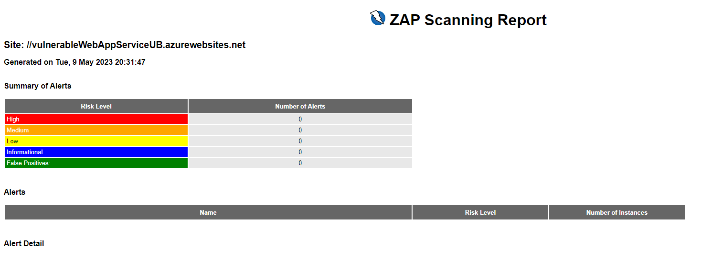

# Guia Práctica.

1.- Crear un proyecto de Azure DevOps

2.- Crear un repositorio 

3.- Importar archivo adjunto zip

4.- Añadir extension a AzureDevOps: OWASP ZAP

5.- Azure DevOps -> Proyect Settings -> Pipelines -> Server Connection --> Añadir Subscripcion Azure:
* Create service connection -> Azure Resource Manager -> Name: myARMConnection

6.- Importar pipeline, cambiar la siguiente linea para que tome la conexión creada en el paso 5
```
  azureSubscriptionValue: 'myARMConnection'
```

## Errores conocidos

1. Al ejecutar la pipeline, puede devolver el siguiente error.

```
##[error]No hosted parallelism has been purchased or granted. To request a free parallelism grant, please fill out the following form https://aka.ms/azpipelines-parallelism-request
```
Pedir acceso gratuito mediante el siguiente formulario: https://aka.ms/azpipelines-parallelism-request

2. Las ultimas versiones del OWASP ZAP Scanner han introducido un error en la generación del reporte. Como consecuencia, la análisis  se ejecutan correctamente como visualizado en la tarea de ***Scan***  

   

Pero, el reporte que se genera resulta vacío y de consecuencia los test-results.xml no se ven reflejado en la pipeline. 


